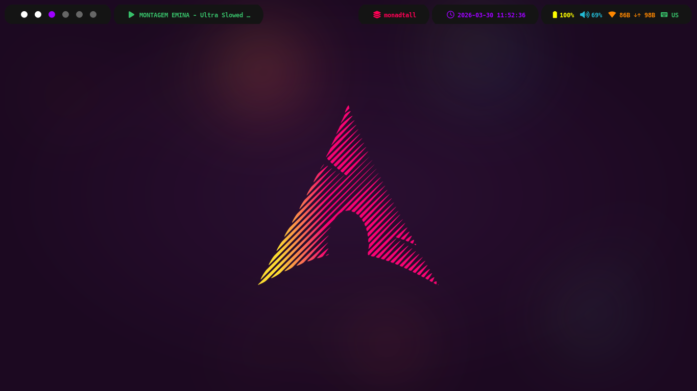
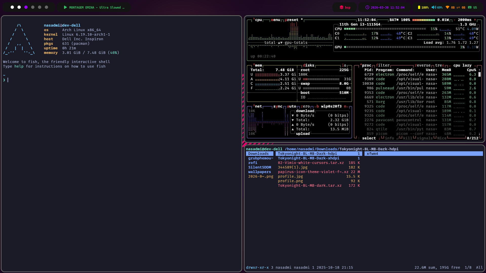

# Qtile Dotfiles: Minimal Arch Rice
Un entorno de escritorio basado en **Qtile (X11)** optimizado para la eficiencia y la estética. Este setup utiliza una paleta de colores vibrante en **Azul, Amarillo y Naranja**, con una automatización completa para instalaciones frescas de **Arch Linux**.
- [**Versión en Inglés**](./README.md)


---

----
## Instrucciones de instalación
Diseñado para ser desplegado en **Arch Linux Minimal**. El script de instalación gestiona dependencias, temas, iconos, cursores y servicios de sistema.

- _Tiempo de configuración_: ~7 minutos
- _Espacio necesario en root (/)_: 10 GB (mínimo) | 25 GB (recomendado)

```bash
git clone https://github.com/Nasadmi/dotfiles.git
cd dotfiles
chmod +x install.sh
./install.sh
```
----
## Atajos de teclado
La tecla ```mod``` está configurada como la tecla Super (Windows).

### Gestión de vetanas y sistema
| Atajo  | Acción |
|--------|--------|
| ```mod + Enter``` | Abrir terminal (Kitty) |
| ```mod + w``` | Cerrar vetana enfocada |
|```mod + f```|Alternar pantala completa|
|```mod + t```|Alternar estado flotante|
|```mod + Tab```|Alternar entre Layouts|
|```mod + Control + r```|Reiniciar Qtile|
|```mod + Control + q```|Salir de Qtile (Shutdown)|
|```mod + .``` / ```mod + ,```|Cambiar entre monitores (Next/Previous)|
|```mod + Space```|Cambiar distribución de teclado (es,us por defecto)|

### Navegación y Layout
**Basado en el estilo de Vim:**
- *h: izquierda*
- *j: abajo*
- *k: arriba*
- *l: derecha*

| Atajo  | Acción |
|--------|--------|
| ```mod + [h,j,k,l]``` | Mover foco |
| ```mod + Shift + [h,j,k,l]``` | Desplazar ventana en el layout |
|```mod + Control + [h,j,k,l]```|Cambiar tamaño de vetana (menos en monadtall y monadwide)|
|```mod + n```|Normalizar tamaño de ventanas|

## Aplicaciones y utilidades

| Atajo  | Acción |
|--------|--------|
| ```mod + r``` | Launcher (Rofi Type-4) |
| ```mod + v``` | Historial de portapapeles (Greenclip) |
|```mod + Shift + v```|Limpiar portapapeles|
|```mod + b```|Abrir navegador (Google Chrome)|
|```mod + e```|Gestor de archivos (Thunar)|
|```mod + s```|Capturar Pantalla (Flameshot)|

## Scratchpad (Menús Emergentes)
| Atajo  | Acción |
|--------|--------|
| ```mod + Shift + Enter``` | Terminal Flotante rápida |
| ```mod + a``` | Control de volumen (Pavucontrol) |
|```mod + Shift + b```|Gestor bluetooth (Blueman)|
|```mod + p```|Reproductor (Youtube Music con Pear Desktop)|

## Bootloader
Se puede usar cualquiera, pero el script esta preparado para configurar el Grub en caso de estar instalado, usando el tema [Graphite GTK Theme GRUB](https://github.com/vinceliuice/Graphite-gtk-theme)

## [Configuración](./SETTINGS.es.md)

## Componentes (Core)
- **WM**: Qtile (X11)
- **Terminal**: Kitty
- **Shell**: Fish Shell + Starship (preset Nerd-Font-Symbols)
- **Compositor**: Picom (Pijulius fork)
- **Portapapeles**: Greenclip
- **Barra**: Custom Qtile Bar con detección dinámica de red vía network_finder.py.
- **Gestor de Pantalla**: SDDM ([tema SilentSDDM por defecto](https://github.com/uiriansan/SilentSDDM))

## Apariencia
- **Tema de GTK**: [Tokyonight](https://github.com/Fausto-Korpsvart/Tokyonight-GTK-Theme) (Dark, Moon, MacOS)
- **Iconos**: [Papirus](https://github.com/PapirusDevelopmentTeam/papirus-icon-theme)
- **Cursor**: [Vimix White](https://github.com/vinceliuice/Vimix-cursors)
- **Tipografía**: [FiraMono Nerd Font / Hack Nerd Font](https://www.nerdfonts.com/font-downloads)

## Notas Adicionales
1. **Root Shell**: Para aplicar la configuración de Fish/Starship al usuario root, ejecuta:
```bash
sudo ./setroot.sh
```
2. **SDDM**: La sesión por defecto está configurada para **Qtile (X11)**, evitando la entrada accidental a sesiones Wayland no configuradas (en Wayland no funciona).

3. **Icat**: Para abrir imágenes en Kitty hay un alias configurado dentro del config.fish. Ejecuta ```kt``` para abrir imágenes en Kitty.
```bash
# ~/.config/fish/config.fish
starship init fish | source
alias kt="kitten icat"
fastfetch --config os
```